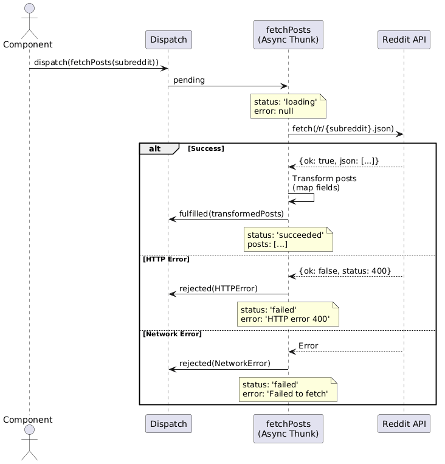
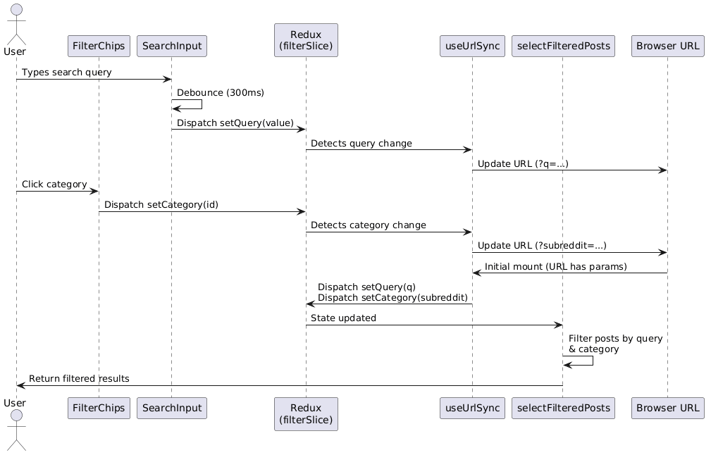

# Reddit Client

A minimalist and modern Reddit client application that allows users to browse subreddits, search for posts, and read comments in a clean, responsive interface.

## Motivation

This project was created to explore modern frontend development practices using React, Redux Toolkit, and Vite. It serves as a practical example of managing complex state, interacting with external APIs (*Reddit JSON API*), and implementing a responsive user interface with robust testing.

## Development approach
I started by breaking my project down into abstract epics. These epics were later associated with issues that together defined each epic’s *definition of done*.

During the project I adopted a test-driven workflow. Unit tests were generated using the Claude tool [*claude-instructions*](https://github.com/wbern/claude-instructions). I instructed the AI to produce one failing test at a time, following the Red phase of the Red–Green–Refactor cycle; it was then my responsibility to make the test pass. If I got stuck, I asked Claude to guide me using a Socratic approach.

This method reinforced the discipline of implementing focused, incremental changes and helped me form a clear understanding of each component’s expected behavior before writing any production code.

When I opened a pull request, I used the AI review tool CodeRabbit to identify weaknesses in the code.

## Features

- **Browse Categories**: Quickly switch between popular topics like Programming, World News, Gaming, and more.
- **Search**: Real-time filtering of posts by title or content.
- **Post Details**: View full post content and comment threads in a dedicated modal.
- **URL Synchronization**: Shareable links that preserve the current category and search query.
- **Robust State Management**: Built with Redux Toolkit for efficient data fetching and caching.

## Tech/framework used

<b>Built with:</b>
- [React](https://react.dev/)
- [Redux Toolkit](https://redux-toolkit.js.org/)
- [Vite](https://vitejs.dev/)
- [TypeScript](https://www.typescriptlang.org/)

<b>Testing:</b>
- [Vitest](https://vitest.dev/) (Unit/Component Testing)
- [Playwright](https://playwright.dev/) (End-to-End Testing)

## Sequence diagram
### During epic 1


### During epic 3


## Code style

This project enforces code quality and consistency using:
- **ESLint** for static code analysis
- **TypeScript** for static type checking

## Installation

To get a local development environment running, follow these steps:

1. Clone the repository
2. Navigate into the project directory:
   ```bash
   cd reddit-client
   ```
3. Install dependencies:
   ```bash
   npm install
   ```
4. Start the development server:
   ```bash
   npm run dev
   ```

## Tests

The project includes both unit/component tests and end-to-end tests.

To run the unit tests with Vitest:
```bash
npm run test
```

To run unit tests with coverage:
```bash
npm run test:ci
```

To run the end-to-end tests with Playwright:
```bash
npm run test:e2e
```

## How to use?

1. Start the application using `npm run dev` and open your browser to the local URL provided by Vite.
2. Use the top navigation bar to search for specific topics.
3. Click on the category chips (e.g., Programming, Science) to filter posts by subreddit.
4. Click on any post card to open a modal and read the comments.
5. Click the "r/reddit" logo to return to the home feed.

## API Reference

This application consumes the [Reddit JSON API](https://www.reddit.com/dev/api/). It fetches public data by appending `.json` to standard Reddit URLs.

## License

MIT © hevol
